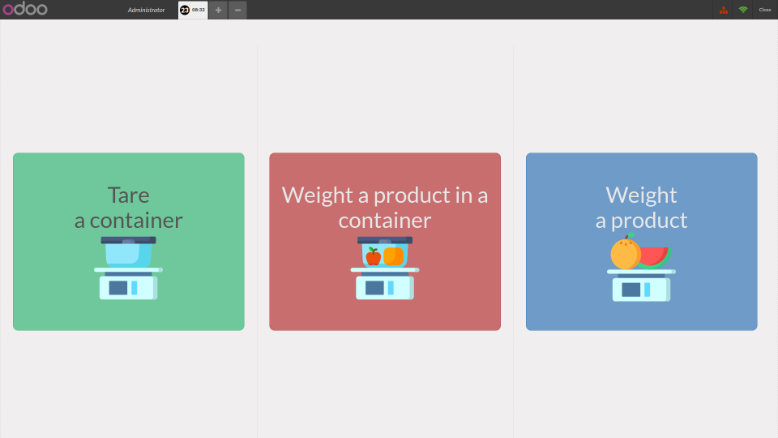
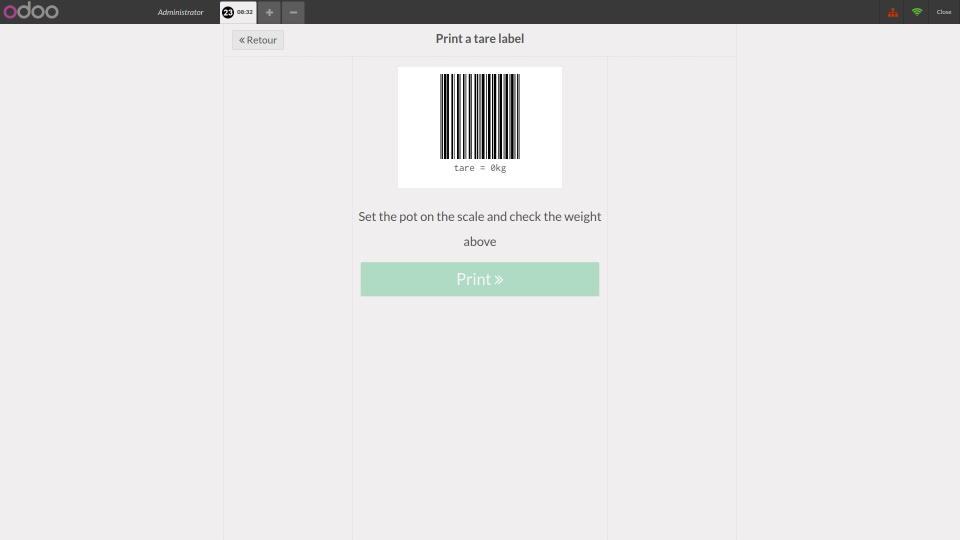
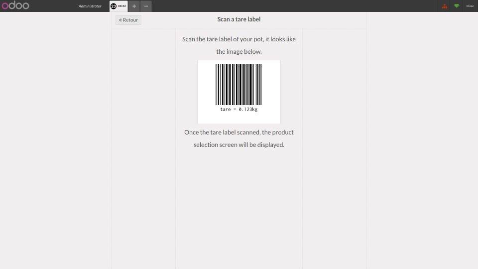
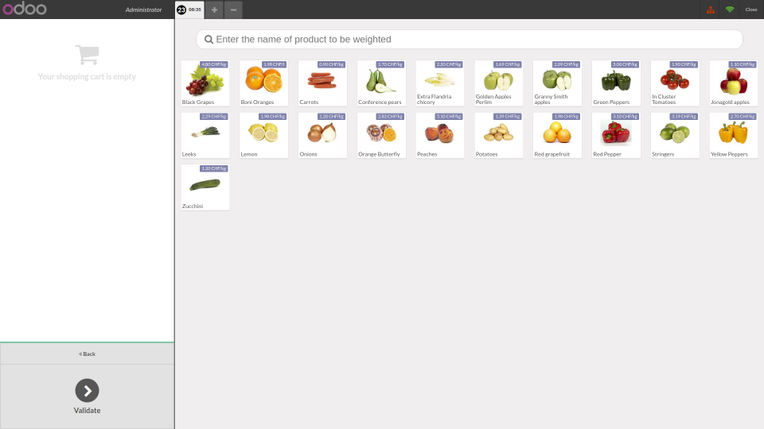

This add-on allows you to run a grocery in a Bring Your Own Container (BYOC) schema. With this add-on your customers will be able to buy loose goods using their own reusable container. This add-on offer customers the possibility to weight their vegetables and fruits before they checkout. To weight fruit and vegetable before checkout time will speed up the checkout and make your customer happier.

The self service BYOC scheme has six steps:
    1. The customer weighs the pot and sticks the tare barcode onto the his or her pot.
    2. The customer go and put loose goods into the labeled pot.
    3. The customer scans the tare barcode. POS saves the tare value.
    4. The customer weighs the pot with loose goods inside. POS computes the price to pay.
    5. The customer gets a price barcode label indicating the price to pay.
    6. During checkout, the cashier scans the price barcode label.

This add-on requires you to have a barcode label printer and an electronic scale. Your customers are expected to use this add-on in a self-service way. This add-on adds multiple news screens that are displayed only on the selected POS.

This add-on displays only the products that are meant to be weighted with a scale.

Home screen of the selected POS is:

To click on "tare a container" shows:

To click on "weight a product in a container" shows:

To click on "weight a product" shows:

